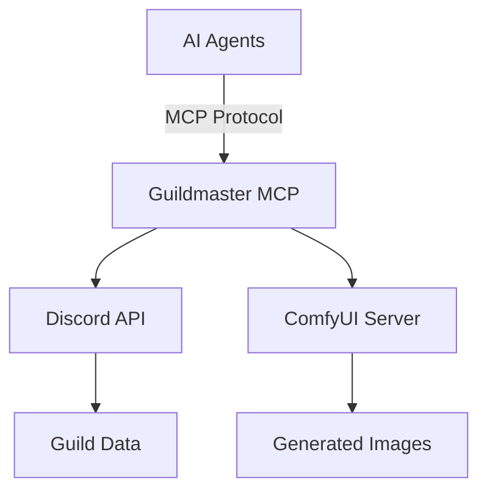

<!-- Generated: 2025-12-23 | DDD Phase 1: Documentation Genesis -->

# Future Enhancements

Areas identified during DDD Phase 1 for future improvement.

---

## Visual Enhancements

### 1. Architecture Diagrams (Mermaid)

**Current:** ASCII art in docs/architecture.md  
**Proposed:** Interactive mermaid.js diagrams

**Files to update:**
- docs/architecture.md
- docs/MULTI_AGENT_WORKFLOWS.md (agent coordination flows)
- docs/COMFYUI_INTEGRATION.md (image delivery pipeline)

---

### 2. Screencast Demonstrations

**Proposed screencasts:**

1. **30-Second Docker Setup** (README.md quick start)
   - Show: `docker run` → verify connection → first tool call
   - Length: 30 seconds
   - Format: Animated GIF or YouTube embed

2. **ComfyUI Workflow Export** (BYOW guide)
   - Show: Design in ComfyUI → Export API format → Test in Guildmaster
   - Length: 2 minutes
   - Target: docs/COMFYUI_INTEGRATION.md

3. **Claude Desktop Configuration** (agent setup)
   - Show: Edit config → Restart Claude → Use tools
   - Length: 1 minute
   - Target: README.md Agent Integration section

4. **Multi-Agent Workflow** (orchestration demo)
   - Show: Weekly briefing workflow execution
   - Length: 3 minutes
   - Target: docs/MULTI_AGENT_WORKFLOWS.md

**Hosting:** GitHub repository `/docs/assets/` or YouTube playlist

---

## Technical Enhancements

### 3. Interactive Tool Documentation

**Current:** Static markdown with code examples  
**Proposed:** Interactive API explorer

**Features:**
- Live parameter validation
- Try-it-now sandbox
- Response schema visualization
- Auto-generated code snippets

**Technology:** Swagger/OpenAPI or custom web app

---

### 4. Visual Workflow Designer

**Proposed:** Drag-and-drop multi-agent workflow builder

**Features:**
- Visual agent graph
- Tool assignment UI
- Context sharing configuration
- Export to YAML

**Target users:** Non-technical guild leaders

---

## Documentation Enhancements

### 5. Localization

**Proposed languages:**
- Spanish (ES) — Large WoW community
- German (DE) — European guilds
- French (FR) — European guilds
- Portuguese (PT-BR) — Brazilian community

**Scope:**
- README.md
- docs/INSTALLATION.md
- docs/CONFIGURATION.md
- Tool descriptions (for non-English LLMs)

---

### 6. Video Tutorials

**Proposed tutorial series:**

1. **Installation & Setup** (5 min)
2. **First Tool Call** (3 min)
3. **ComfyUI Integration** (10 min)
4. **Multi-Agent Workflows** (15 min)
5. **Custom Theme Creation** (7 min)

**Platform:** YouTube or self-hosted

---

## Community Enhancements

### 7. Community Theme Gallery

**Proposed:** GitHub repository or website with:
- User-submitted custom themes
- Screenshots/examples
- Download links
- Voting/rating system

**Example themes:**
- Cyberpunk/Shadowrun
- Star Wars
- Lord of the Rings
- Warhammer 40K

---

### 8. Workflow Template Library

**Proposed:** Collection of ready-to-use multi-agent workflows

**Categories:**
- Moderation (automated chat analysis)
- Events (weekly/monthly automated posts)
- Onboarding (new member welcome automation)
- Analytics (guild health reports)

---

## Implementation Priority

**Phase 2 (Q1 2026):**
1. Mermaid diagrams (high impact, low effort)
2. 30-second Docker screencast (marketing value)
3. Interactive tool documentation (developer experience)

**Phase 3 (Q2 2026):**
4. Full screencast series
5. Community theme gallery
6. Workflow template library

**Phase 4 (Q3 2026):**
7. Localization (Spanish, German)
8. Visual workflow designer

---

## Contributing

See [docs/CONTRIBUTING.md](./CONTRIBUTING.md) for how to contribute these enhancements.

**Priority:** Core functionality > Documentation polish > Visual enhancements

---

**The craft evolves. The documentation grows.** ⚔️
